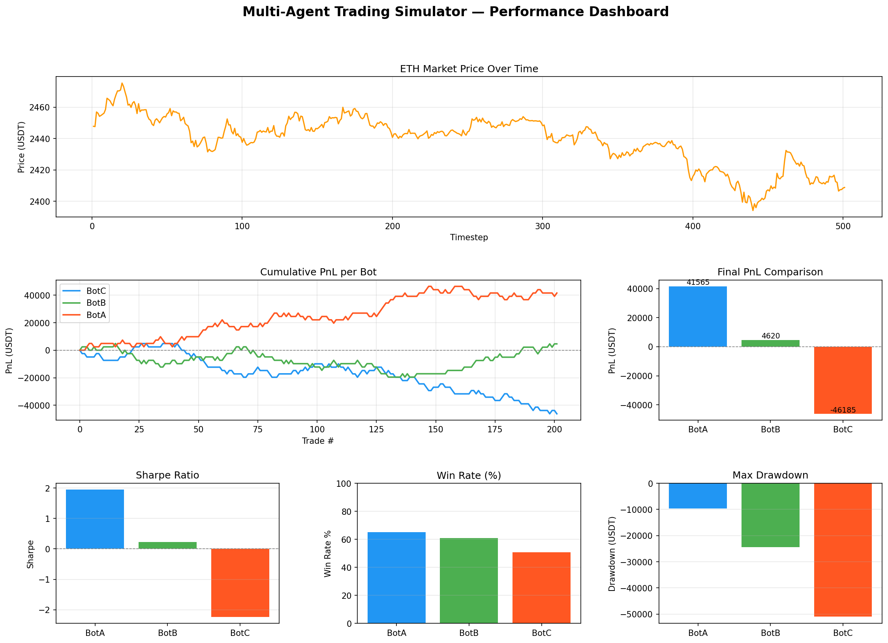

#  C++ Multi-Agent Trading Simulator

A high-performance, event-driven trading simulator written in C++ that models multiple autonomous trading agents competing in a real-time limit order book using historical cryptocurrency market data. Includes a Python-powered performance analytics dashboard.

---

##  Overview

This project simulates a realistic financial exchange where multiple bots place buy/sell orders based on different strategies. Orders are matched through a **Limit Order Book (LOB)** engine using real **ETH/USDT** 1-minute candlestick data from Binance. After each simulation run, a Python script generates a full performance dashboard with key trading metrics.

---

##  Features

-  **Limit Order Book** — price-time priority matching engine
-  **Multi-Agent System** — multiple bots trading simultaneously
-  **Real Market Data** — plugs into Binance historical CSV data
-  **Random Bot** — places randomized buy/sell orders around market price
-  **Momentum Bot** — trend-following strategy using a rolling price window
-  **Event-driven loop** — tick-by-tick simulation over historical data
-  **Trade Logging** — all executed trades saved to CSV automatically
-  **Performance Dashboard** — Python visualization with 6 key metrics charts

---

##  Project Structure

```
crypto-trading-simulator/
├── src/
│   ├── main.cpp              # Entry point, simulation loop
│   ├── order.hpp             # Order struct definition
│   ├── orderbook.hpp         # Limit Order Book class
│   ├── matching_engine.hpp   # Matching engine interface
│   ├── matching_engine.cpp   # Order matching logic + trade logging
│   ├── market_data.hpp       # Market data loader interface
│   └── market_data.cpp       # CSV parser for tick data
├── agents/
│   ├── bot.hpp               # Abstract base Bot class
│   ├── random_bot.hpp        # Random trading agent
│   ├── momentum_bot.hpp      # Momentum-based trading agent
│   └── momentum_bot.cpp      # Momentum bot implementation
├── data/
│   ├── eth_1m.csv            # Historical ETH/USDT 1m candle data (Binance)
│   ├── trade_log.csv         # Generated — executed trades per run
│   └── price_log.csv         # Generated — price at each timestep
├── visualize.py              # Python performance analytics dashboard
├── Makefile
└── README.md
```

---

##  Getting Started

### Prerequisites

**C++ compiler:**

Mac:
```bash
xcode-select --install
```

Linux/Ubuntu:
```bash
sudo apt install g++ make
```

Windows — install [MSYS2](https://www.msys2.org/) then:
```bash
pacman -S mingw-w64-x86_64-gcc make
```

**Python dependencies:**
```bash
pip3 install pandas numpy matplotlib
```

---

### Build & Run

```bash
# Clone the repo
git clone https://github.com/traveller03310/Cpp-Multi-Agent-Trading-Simulator.git
cd Cpp-Multi-Agent-Trading-Simulator

# Build and run simulator
make run
```

### Other commands

```bash
make        # Build only
make clean  # Remove compiled binary
```

---

##  Getting Market Data

This simulator uses Binance 1-minute OHLCV candlestick data.

1. Go to [https://data.binance.vision](https://data.binance.vision)
2. Navigate to `data → spot → monthly → klines → ETHUSDT → 1m`
3. Download any `.zip` file
4. Unzip and rename the CSV to `eth_1m.csv`
5. Place it in the `data/` folder

---

##  Performance Visualization

After running the simulator, a trade log and price log are automatically saved to the `data/` folder. Run the Python dashboard to analyze results:

```bash
python3 visualize.py
```

### Dashboard Includes

| Chart | Description |
|---|---|
| **ETH Price** | Market price across all timesteps |
| **Cumulative PnL** | Running profit/loss per bot over time |
| **Final PnL** | Bar chart comparing total PnL across bots |
| **Sharpe Ratio** | Risk-adjusted return per bot |
| **Win Rate** | Percentage of profitable trades per bot |
| **Max Drawdown** | Worst peak-to-trough loss per bot |

### Sample Metrics Output

```
===== PERFORMANCE METRICS =====
 Bot   Final PnL   Sharpe Ratio   Max Drawdown   Win Rate (%)   Total Trades
BotA     1842.50          0.412       -3210.00           54.2             38
BotB     -923.00         -0.218       -5100.00           43.8             32
BotC      310.75          0.101       -2840.00           50.0             30
```

### Sample Dashboard



---

##  Sample Terminal Output

```
=== Timestep 1 ===
Price: 2447.83

=== Timestep 2 ===
Price: 2447.65

=== Timestep 3 ===
Price: 2456.96
Trade executed: 1 ETH at 2451.96 between BotA and BotB

Logs saved to data/trade_log.csv and data/price_log.csv
```

---

##  Trading Agents

### RandomBot
Places randomized limit orders slightly above or below the current market price. Simulates noise traders in the market.

### MomentumBot
Tracks a rolling window of recent prices. Buys when price is trending up, sells when trending down. Simulates trend-following strategies.

---

##  Roadmap

- [ ] AI/ML-powered trading agent
- [ ] Reinforcement Learning agent
- [ ] Multithreaded matching engine
- [ ] More strategy bots (RSI, MACD, Bollinger Bands)
- [ ] Risk management (position limits, stop loss)
- [ ] Unit tests
- [x] Trade history logging to CSV
- [x] Performance visualization dashboard

---

##  Built With

- **C++17** — core simulator and matching engine
- **Python 3** — performance analytics and visualization
- **pandas / numpy / matplotlib** — data processing and charting
- **Binance Public Data API** — historical market data

---

##  License

This project is open source and available under the [MIT License](LICENSE).

---

##  Acknowledgements

- [Binance Public Data](https://data.binance.vision) for free historical market data
- Inspired by real-world limit order book implementations used in HFT systems
